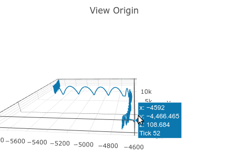

[](https://github.com/NeKzor/sdp/actions/workflows/ci.yml)
[](https://github.com/NeKzor/sdp/actions/workflows/cd.yml)
[](https://jsr.io/@nekz/sdp)
[](https://www.npmjs.com/package/@nekz/sdp)

# sdp

Simple Source Engine demo parser. Try it out on [StackBlitz]!

[StackBlitz]: https://stackblitz.com/edit/sdp-playground?file=main.mjs

## Features

- Support for multiple engines
  - Portal 2
  - Half-Life 2
  - Custom engine, see [Strata Source example](./examples/custom/strata.ts)
- Optional decoding of message data
  - [User command info]
  - [NET/SVC messages]
  - [Send tables]
  - [String tables]
  - [Game events]
- Speedrun timing
  - Rules for Portal, Portal 2 and mods
  - [SAR] timing
- Utils
  - Steam ID parsing
  - SAR data

[User command info]: https://dem.nekz.me/dem/classes/usercmdinfo.html
[NET/SVC messages]: https://dem.nekz.me/dem/classes/netsvc.html
[Send tables]: https://dem.nekz.me/dem/classes/sendtable.html
[String tables]: https://dem.nekz.me/dem/classes/stringtable.html
[Game events]: https://dem.nekz.me/dem/classes/gameevent.html
[SAR]: https://sar.portal2.sr

## Examples

### Read header only

Using Deno + TypeScript:

```ts
import { SourceDemoParser } from 'jsr:@nekz/sdp';

const demo = SourceDemoParser.default()
    .setOptions({ messages: false })
    .parse(Deno.readFileSync('demo.dem'));

console.log(demo);

/*
    SourceDemo {
    demoFileStamp: 'HL2DEMO',
    demoProtocol: 3,
    networkProtocol: 15,
    serverName: 'localhost:0',
    clientName: 'Can\'t Even',
    mapName: 'testchmb_a_00',
    gameDirectory: 'portal',
    playbackTime: 3.944999933242798,
    playbackTicks: 263,
    playbackFrames: 253,
    signOnLength: 80641,
    messages: [] }
*/
```

### Read UserCmd messages

Using Node + JavaScript:

```mjs
import fs from 'node:fs';
import { DemoMessages, SourceDemoParser } from '@nekz/sdp';

const demo = SourceDemoParser.default()
    .setOptions({ userCmds: true })
    .parse(fs.readFileSync('demo.dem'));

const IN_JUMP = 1 << 1;

const registeredJumps = demo
    .findMessages(DemoMessages.UserCmd)
    .filter(({ userCmd }) => userCmd.buttons & IN_JUMP);

console.log('registered jumps:', registeredJumps.length);

/*
    registered jumps: 270
*/
```

The [examples directory](./examples/) contains more examples for Node and Deno.

### View Origin

[](https://nekz.me/parser)

Used in [nekz.me/parser](https://nekz.me/parser).
Updated example can be found in [examples/web/parser.html](./examples/web/parser.html).

## Dependencies

Vendored [inolen/bit-buffer] for TypeScript port + improvements.

[inolen/bit-buffer]: https://github.com/inolen/bit-buffer

## License

[MIT License](./LICENSE)
